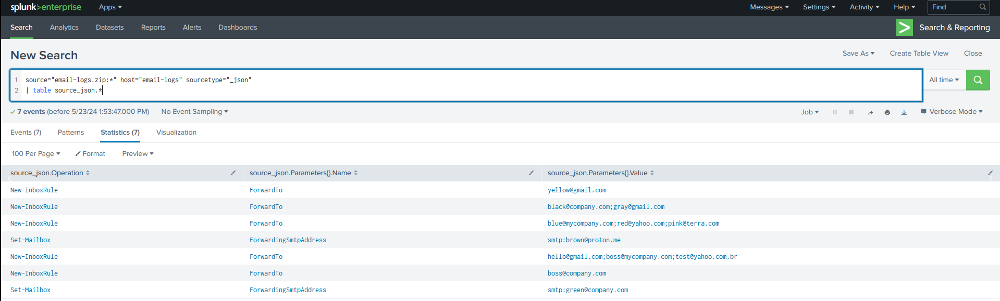

# Exploring Rule Customization in InsightIDR and Splunk

## Summary

Customization of rules is essential for both detecting malicious behaviors and identifying them accurately, avoiding false positives. Let's delve into a scenario where it was necessary to manipulate the detection rule "[Attacker Technique - Inbox Forwarding Rule Created](https://docs.rapid7.com/insightidr/cloud-service-activity/)" on Rapid7's InsightIDR to avoid cluttering the alerts.

In this write-up I will exemplify what I was able to explore in the customization of InsightIDR using [LEQL (Log Entry Query Language)](https://docs.rapid7.com/insightidr/components-for-building-a-query/), which is suitable for straightforward, security-focused log queries with an easy-to-learn syntax. I will also compare it with [SPL (Search Processing Language)](https://docs.splunk.com/Splexicon:SPL) from Splunk, which is more appropriate for powerful, flexible, and detailed data analysis capabilities.

## Scenario

The rule "[Attacker Technique - Inbox Forwarding Rule Created](https://docs.rapid7.com/insightidr/cloud-service-activity/)" is native of InsightIDR. As mentioned by [MITRE ATT\&CK](https://attack.mitre.org/techniques/T1114/003/), adversaries can abuse this feature to collect sensitive information, monitor victims' activities or even maintain persistent access to emails, even after the compromised credentials are reset. Rapid7's InsightIDR proposes detection whenever an email redirection is created.

This is an example of a simplified JSON log that would trigger the rule:

```
{
    "source_json": {
        "Operation": "New-InboxRule",
        "Parameters": [
            {
                "Name": "ForwardTo",
                "Value": "hello@gmail.com;boss@company.com;teste@yahoo.com.br"
            }
        ]
    }
}
```

However, let’s assume that our company doesn't want to see alerts for domains of its own (@mycompany.com and @company.com).

## Solutions

### InsightIDR

The easiest way I could find to acheive this was through regular expression, because we're working with a multi-valued field. Simple conditions like `IS` or `CONTAINS` will not work. The regular expression bellow will match when `source_json.Parameters.Value` holds the value of `text@company.com;test@mycompany.com;othertest@company.com` but will not when it holds the value `test@mycompany.com;test2@company.com.br;empresa@gmail.com`.

```regex
^(\w+?@((mycompany|company)\.com(\.br)*?))(;\s*?\w+?@((mycompany|company)\.com(\.br)*?))*?$
```


The explanation for the regex and an example can be found on the link: [https://regex101.com/r/s8FQdh/1](https://regex101.com/r/s8FQdh/1).


That's it, we just need to create a rule exception to suppress the alert whenever there is a match for the pattern or change the rule logic.

### Splunk

There are several ways to solve our problem with Splunk. I will exemplify two solutions that I found (still learning, of course) and was happy with at the time of this writing. First, these are the example logs that I will be working on.

<figure><figcaption></figcaption></figure>


For this lab, I used TryHackMe rooms that contain Splunk instances already set up. It is also possible to upload your own logs.


It is possible to use a negative lookahead in the regex (which InsightIDR doesn't support) for this multi-valued field.

<figure><figcaption></figcaption></figure>

* `| table source_json.*`: Creates a table view.
* `| rename "source_json.Parameters{}.Value" as value`: Simplifies the field to avoid errors with .JSON lists.
* `| eval trigger=if(match(value,"@(?!company.com|mycompany.com)([^;]+)"), 1, 0)`: The eval function creates the field "trigger" to be populated with the value 1 if it matches and 0 if it does not. The regex is a negative lookahead, which will identify or filter out email addresses that belong to specific domains (in this case, "company.com" or "mycompany.com") and only act on email addresses with other domains.
* `| search trigger=1`: Filters for the value 1.

But it makes more sense to break this field with `mvexpand` and use a simple search. I performs better this way.

<figure><figcaption></figcaption></figure>

* `| makemv delim=";" value`: Transforms a string with multiple values into a list of values separated by the delimiter ";".
* `| mvexpand value:` Expands the multiple values into separate rows, duplicating the other fields for each separated value.
* `| table value, name, operation`: Creates a table displaying the fields "value", "name", and "operation".
* `| search NOT value="*@mycompany.com" AND NOT value="*@company.com"`**:** Excludes events where the "value" field contains "@mycompany.com" and "company.com".

## Conclusion

I was interested in this comparison because my first solution for InsightIDR was the negative lookahead regex. However, since it was [not supported](https://docs.rapid7.com/insightidr/ls-glossary/#r), I became curious to see if Splunk would accept it. In the process, I discovered an even better solution for the problem. I am sure there are many more ways to achieve this.

In summary, there are several ways to customize rules for monitoring email redirections. While some tools may offer more powerful capabilities, the important thing is to ensure effective monitoring of email redirections.
